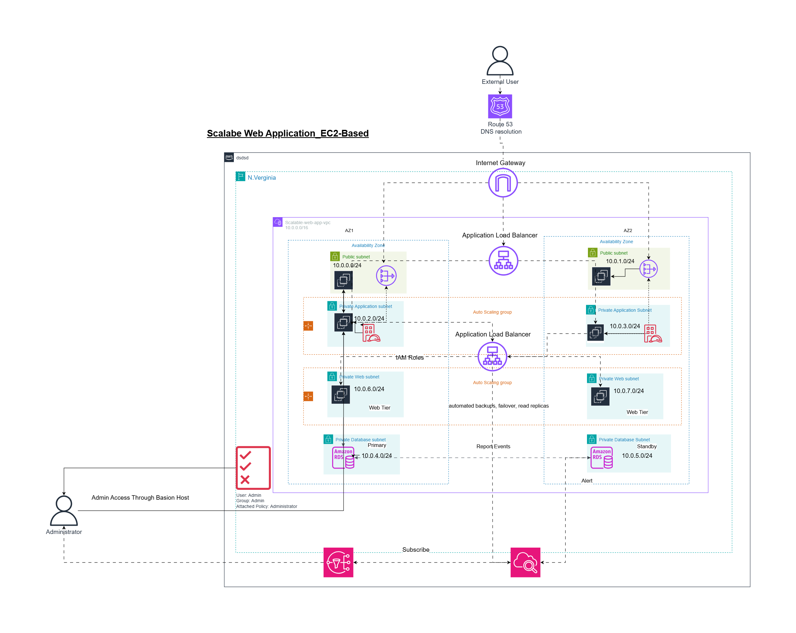
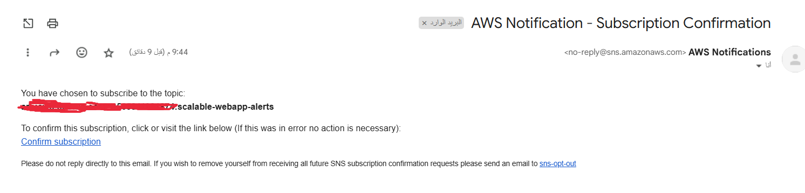

# Scalable Web Application - EC2 Based Architecture

This repository contains a well-structured, scalable, and highly available **AWS EC2-based web application architecture**. It includes both the **final PNG diagram with CIDR labels** and the **editable draw.io source file (XML format)**.

## 📑 Table of Contents

1. [Architecture Visualization](#-architecture-visualization)
   - Infrastructure Diagram
   - SNS Notification Setup
   - Infrastructure Walkthrough Video

2. [Components Overview](#-components-overview)
   - Subnet Allocation
   - Architecture Components
   - Networking
   - Compute
   - Load Balancing
   - Database Layer
   - Bastion Host

3. [Identity & Access Management](#-identity--access-management-iam)
   - IAM Roles and Access

4. [Monitoring & Logging](#-monitoring--logging)
   - CloudWatch
   - SNS Alerts

5. [Admin Access Process](#-admin-access-process)

6. [Repository Structure](#-repository-structure)

7. [Infrastructure as Code (Terraform)](#-infrastructure-as-code-terraform)
   - Key Terraform Components
   - Deployment Steps
   - Security Considerations

8. [Best Practices](#-best-practices-followed)

9. [Author Information](#-author)

10. [Additional Notes](#-notes)

---

## 📸 Architecture Visualization

### Infrastructure Diagram


### SNS Notification Setup


### Infrastructure Walkthrough Video
[Watch Infrastructure Walkthrough on Google Drive](https://drive.google.com/file/d/1NdcfrlFaVWm49I51JbtIS5DyvjzzUnI_/view?usp=sharing)

---

## 🧩 Components Overview

- **Region:** N. Virginia (`us-east-1`)
- **VPC CIDR Block:** `10.0.0.0/16`

---

### 🔷 Subnet Allocation (CIDR Blocks)

| **Purpose**            | **AZ1 (us-east-1a)** | **AZ2 (us-east-1b)** |
|------------------------|----------------------|----------------------|
| Public Subnet          | `10.0.0.0/24`        | `10.0.1.0/24`        |
| Private App Subnet     | `10.0.2.0/24`        | `10.0.3.0/24`        |
| Private DB Subnet      | `10.0.4.0/24`        | `10.0.5.0/24`        |
| Private Web Subnet     | `10.0.6.0/24`        | `10.0.7.0/24`        |

---

## 🛠️ Architecture Components

### 🔐 Networking
- **Internet Gateway:** Enables internet access for resources in public subnets.
- **Route 53:** Provides DNS resolution for the web application.
- **NAT Gateway (Optional):** Allows private subnets to initiate outbound traffic to the internet.
- **Route Tables:** Associated with public and private subnets accordingly.

### 📦 Compute
- **Application Tier EC2 Instances:** Hosts the application backend inside private application subnets (10.0.2.0/24 and 10.0.3.0/24), managed by an Auto Scaling Group.
- **Web Tier EC2 Instances:** Hosts the web serving layer inside private web subnets (10.0.6.0/24 and 10.0.7.0/24), managed by a separate Auto Scaling Group.

### ⚖️ Load Balancing
- **Internet-facing Application Load Balancer (ALB):** Distributes incoming HTTP/S traffic from the internet to the Application Tier EC2 instances.
- **Internal Application Load Balancer (ALB):** Distributes traffic from the Application Tier to the Web Tier EC2 instances.

### 💾 Database Layer
- **Amazon RDS (Multi-AZ):**
  - **Primary:** In `10.0.4.0/24`
  - **Standby:** In `10.0.5.0/24`
  - Automatic backups, failover, and read replicas.

### 🧑‍💻 Bastion Host
- **Deployed in Public Subnet**
- Allows secure SSH access to EC2 instances in private subnets.
- Admin IAM user access only.

---

## 👤 Identity & Access Management (IAM)

| **Role**    | **Access**                |
|-------------|---------------------------|
| Admin       | Full access via Bastion   |
| EC2 Role    | Access to CloudWatch, S3  |
| RDS Role    | Managed by AWS            |

---

## 📊 Monitoring & Logging

- **Amazon CloudWatch:** 
  - Monitors EC2, RDS, ALB health
  - Triggers alarms and notifications
- **SNS Alerts:** Sends notifications to subscribed admins on critical events.

---

## 🧑‍💻 Admin Access Process

1. Admin authenticates via IAM.
2. Connects to the **Bastion Host** (public subnet).
3. SSH to private EC2 instances using internal IP.
4. All actions are logged and monitored.

---

## 📁 Repository Structure

```
scalable-webapp-infra/
├── diagram/
│   ├── labeled-architecture.png    # Final labeled AWS architecture diagram
│   ├── architecture-drawio.xml     # Editable source file (draw.io format)
│   ├── AWS_SNS.png                 # SNS notification setup diagram
│   └── AWS_Infra.mkv               # Infrastructure walkthrough video
├── terraform/
│   ├── main.tf                     # Main Terraform configuration
│   ├── variables.tf                # Variable definitions
│   ├── providers.tf                # Provider configurations
│   └── terraform.tfvars            # Variable values (gitignored)
└── README.md                       # This documentation
```

---

## 🚀 Infrastructure as Code (Terraform)

### Key Terraform Components

1. **VPC and Networking**
   - VPC with CIDR 10.0.0.0/16
   - Public and private subnets across two AZs
   - Internet Gateway and route tables
   - Security groups for each tier

2. **Load Balancers**
   - Internet-facing ALB in public subnets
   - Internal ALB in private subnets
   - Target groups for app and web tiers
   - Health checks and listeners

3. **Auto Scaling Groups**
   - App tier ASG in private app subnets
   - Web tier ASG in private web subnets
   - Launch templates with user data
   - Scaling policies and health checks

4. **Database**
   - RDS Multi-AZ deployment
   - Private subnet placement
   - Security group rules
   - Backup and maintenance windows

5. **Monitoring and Alerts**
   - CloudWatch alarms for:
     - ALB latency
     - EC2 CPU utilization
     - RDS performance
   - SNS topics and email subscriptions

### Deployment Steps

1. **Prerequisites**
   ```bash
   # Install Terraform
   # Configure AWS credentials
   # Create key pair in AWS Console
   ```

2. **Initialize Terraform**
   ```bash
   cd terraform
   terraform init
   ```

3. **Review Changes**
   ```bash
   terraform plan
   ```

4. **Apply Infrastructure**
   ```bash
   terraform apply
   ```

5. **Verify Deployment**
   - Check Route 53 DNS resolution
   - Test application access
   - Verify monitoring and alerts

### Security Considerations

- All sensitive data in `terraform.tfvars` is gitignored
- Security groups follow least privilege principle
- Private subnets for sensitive resources
- Bastion host for secure access
- IAM roles with minimal permissions

---

## 🧠 Best Practices Followed

✅ Multi-AZ Deployment  
✅ Private Subnet Isolation  
✅ Least Privilege IAM Policies  
✅ Auto Scaling and Load Balancing  
✅ Bastion Host for secure SSH  
✅ Cloud-native monitoring & alerting  
✅ Clean CIDR and subnet planning  

---

## ✍️ Author

**Mohamed Maged**  
DevOps & Cloud Enthusiast  
[LinkedIn](https://www.linkedin.com/in/magedo)  
[Email](mailto:mohamed.ibn.maged@gmail.com)

---

## 💡 Notes

- You can open the XML file in [draw.io](https://draw.io) or [diagrams.net](https://app.diagrams.net) for further customization.
- Feel free to fork this project and adapt it to your own infrastructure designs.
- Remember to never commit sensitive information like passwords or API keys.
